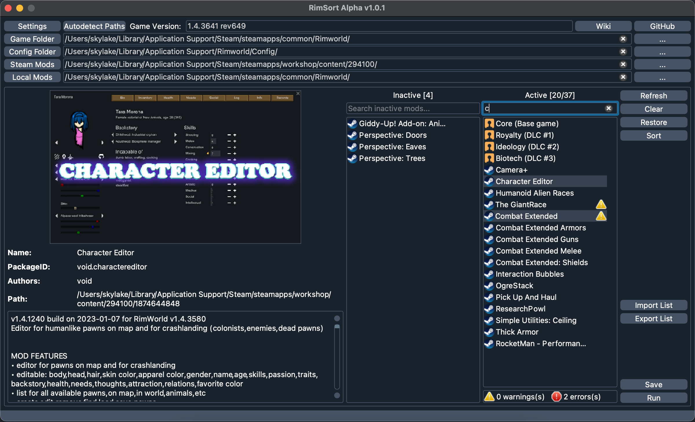

# RimSort

RimSort is an **open source** [RimWorld](https://store.steampowered.com/app/294100/RimWorld/) mod manager for Linux, Mac, and Windows, built from the ground up to be a reliable, community-managed alternative to [RimPy](https://steamcommunity.com/sharedfiles/filedetails/?id=1847679158). RimSort currently provides a number of essential mod-managing features, including (but not limited to):

* Drag and drop mods between an Active and Inactive mods list to enable/disable/rearrange mods
* Automatically sort mod lists with rules derived from mod data, community-submitted rules, and Steam data
* Live view of warnings/errors for mod lists, such as missing dependencies, incompatibilities, load order violations, etc
* Search bar to filter for specific mods in big mod lists
* Clicking on a mod displays detailed information in the Mod Info Panel
* Import, export, and save mod lists

To run RimSort, visit the [Releases](https://github.com/oceancabbage/RimSort/releases) page and download the latest zipped release for your operating system. For Windows and Linux, unzip the download and run the `RimSort` executable inside the unzipped folder. For MacOS, unzip the download and run the `.app` directly. For more information on how to run and use RimSort, visit the [User Guide](https://github.com/oceancabbage/RimSort/wiki/User-Guide).

RimSort is currently under active development. Contributors are welcome! If you are interested in helping develop RimSort, read the [Development Guide](https://github.com/oceancabbage/RimSort/wiki/Development-Guide) on to get started-- this Wiki contains lots of information on how RimSort works under the hood.

There are lots of planned features for RimSort. Most of them are tracked in the [Issues](https://github.com/oceancabbage/RimSort/issues) section of this repo. If you have a feature suggestion, feel free to create an Issue here yourself!
