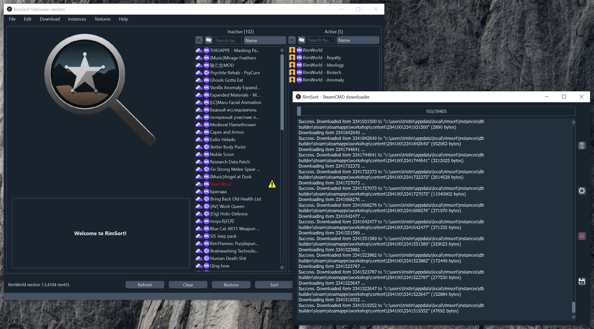

{: .fs-9 }

# RimSort

{: .fs-6 .fw-300 }

A free and open source, multi-platform mod manager for RimWorld.

[Get started now](){: .btn .btn-primary .fs-5 .mb-4 .mb-md-0 .mr-2 }
[Get Releases on GitHub][Releases]{: .btn .fs-5 .mb-4 .mb-md-0 }

---

RimSort is a community centric mod manager and sorter for the game [RimWorld](https://rimworldgame.com/) with support for Windows, macOS, and Linux (Ubuntu builds). It is free and open source, meaning anyone can contribute to it or compile it.

Features all the basic functionality you'd expect from a mod manager plus extras!

---

## Core Features:

- Automatically sort mod lists with rules derived from mod data, community-submitted rules, and Steam data
- Display detailed mod information from the mod info panel
- Import, export, and save mod lists
- A live view of warnings/errors for mod lists, such as missing dependencies, incompatibilities, load order violations, etc.
- Features such as a search bar to easily filter through big mod lists
- Integration with optional auxiliary static databases for improved sorting and info

## Additional Features:

- Additional integration with internal and external tools
  - Git integration for Git mods and databases
  - Integration with [SteamworksPy](https://github.com/philippj/SteamworksPy)
  - This is used to interact with Steam client, as well as provide Steam API game launch
- Log sharing to [0x0.st](http://0x0.st/)
- Mod list sharing with [Rentry.co](https://rentry.co/)
- [todds DDS encoder](https://github.com/joseasoler/todds)
  - Optimize your textures with 3 available presets
- Steam Browser that allows you to download mods via SteamCMD, as well as Steam client
  - Download mods from the Steam Workshop without a copy of RimWorld from Steam
- RimSort Steam DB Builder
  - Generate Steam Workshop Database (SteamDB) on the fly. This is compatible with & synonymous to Paladin's RimPy Community Mod Manager Database db.json schema
  - Tools to compare, merge, and publish databases using this tool
- Rule Editor for configured Community Rules database, as well as User Rules
  - Fully compatible with Paladin's RimPy Community Mod Manager Database `communityRules.json` schema
  - Tools to compare, merge, and publish databases using this tool

## About the project

### License

RimSort is distributed by a [GPL-3.0 license](https://github.com/RimSort/RimSort/tree/main/LICENSE.md)

### Thank you to our contributors!

<ul class="list-style-none">

  <li class="d-inline-block mr-1">
     
  </li>

</ul>

### Code of Conduct

We aim to foster a welcoming community.
[View our Code of Conduct](https://github.com/RimSort/RimSort/tree/main/CODE_OF_CONDUCT.md) on our GitHub repository.

[Wiki]: https://rimsort.github.io
[Repo]: https://github.com/RimSort/RimSort
[Issues]: https://github.com/RimSort/RimSort/issues
[Releases]: https://github.com/oceancabbage/RimSort/releases
[Discord]: https://discord.gg/aV7g69JmR2
