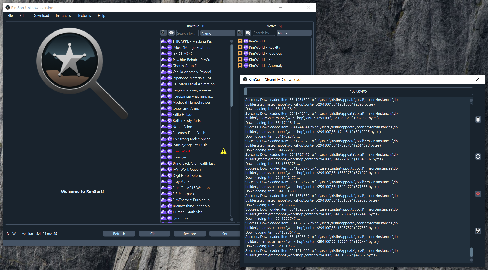

{: .fs-9 }

# RimSort

{: .fs-6 .fw-300 }

Бесплатный открытый кроссплатформенный менеджер модов для RimWorld.

[Начать](user-guide){: .btn .btn-primary .fs-5 .mb-4 .mb-md-0 .mr-2 }
[Скачать на GitHub][Releases]{: .btn .fs-5 .mb-4 .mb-md-0 }



  
  <a style="font-weight: bold;" href="{{site.baseurl}}{{page.url}}{{site.baseurl}}/{{ tongue }}{{page.url}}" >{{ tongue }}</a>{{" "}}{{ site.langsep }}
  

---

RimSort — менеджер и сортировщик модов для [RimWorld](https://rimworldgame.com/) с поддержкой Windows, macOS и Linux. Проект открытый: можно вносить вклад или собирать самостоятельно.

Базовые функции менеджера модов плюс расширенные возможности.

---

## Основное

- Автосортировка списка модов по правилам из данных модов, community rules и Steam
- Подробная информация о моде в панели сведений
- Импорт, экспорт и сохранение списков модов
- Предупреждения об ошибках: зависимости, несовместимости, порядок загрузки
- Поиск и фильтры для больших списков
- Опциональные внешние базы данных для сортировки и метаданных

## Дополнительно

- Git-интеграция для модов и баз данных
- Интеграция со [SteamworksPy](https://github.com/philippj/SteamworksPy)
- Публикация логов на [0x0.st](http://0x0.st/)
- Списки модов через [Rentry.co](https://rentry.co/)
- [todds](https://github.com/joseasoler/todds) — оптимизация текстур DDS
- Браузер мастерской Steam + загрузка через SteamCMD или клиент Steam
- Steam DB Builder и Rule Editor (схемы совместимы с RimPy)

## О проекте

RimSort распространяется под [GPL-3.0](https://github.com/RimSort/RimSort/tree/main/LICENSE.md).

[Wiki]: https://rimsort.github.io
[Releases]: https://github.com/RimSort/RimSort/releases
