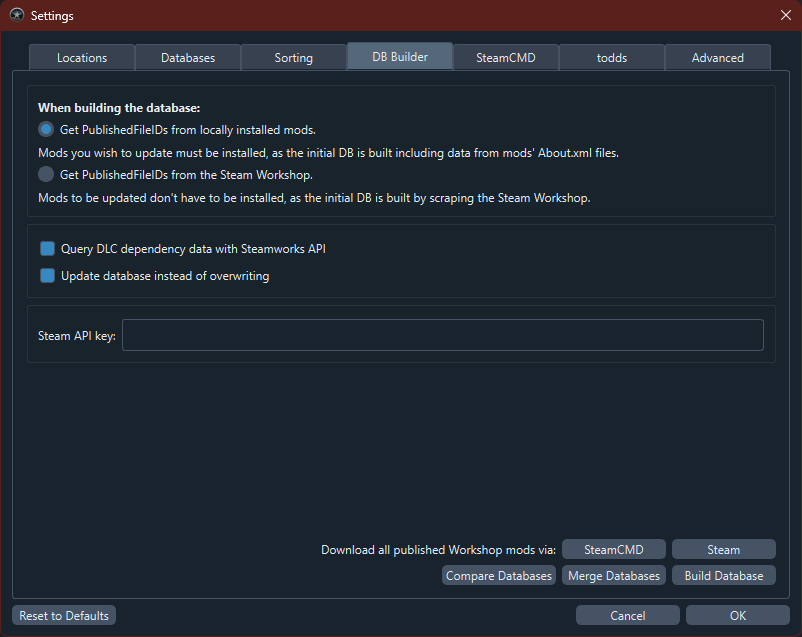

# Сборщик Steam-базы данных

{: .no_toc}

Сборщик БД создаёт и обновляет локальную копию метаданных Steam Workshop.

{: .note}
> **Автоматизация:** сборщик доступен из CLI. См. [CLI Reference](cli-reference#build-db).

## Содержание

{: .no_toc .text-delta }

1. TOC
{:toc}

## Начало работы

_**Примечание:**_ есть «мягкие» требования. Без RimWorld в Steam возможности сборки ограничены.

- На аккаунте Steam обычно нужно потратить не менее $5 для доступа к WebAPI — так RimSort получает зависимости модов.
- Для Steamworks нужна копия RimWorld в Steam.

### Как получить Steam WebAPI ключ

1. Откройте [страницу регистрации ключа](https://steamcommunity.com/login/home/?goto=%2Fdev%2Fapikey). Нужны аккаунт Steam и домен (домен часто не проверяется).

2. После регистрации ключа:

3. _**Не делитесь ключом.**_ После Register отображается ключ. Новый ключ — Revoke и регистрация заново.

4. В RimSort: **Settings → DB Builder → Steam API Key**.

Два режима «Include» для Steam DB (совместим с RimPy `db.json`):

## Опции

### Режимы сборщика (`When building the database:`)

#### «Все моды»

- Опционально DLC-зависимости через Steamworks после WebAPI.
- Точная, возможно неполная БД без запроса всех PublishedFileId через WebAPI — нужен список ID.
- Только метаданные из **установленных** модов, с `packageId`.
  - Полная БД с нуля — нужно скачать весь Workshop.
  - Частичное обновление без полной выгрузки Workshop.

#### «Без локальных данных»

- Опционально DLC через Steamworks.
- «Полуполная» БД: все PublishedFileId через WebAPI.
- **Без** локальных метаданных и `packageId`.
  - ID через WebAPI, без локальных модов.
  - Можно создать БД без модов, потом дополнить режимом «Все моды».

### Query DLC dependency data with Steamworks API

{: .d-inline-block}
Рекомендуется
{: .label .label-green }

Для DLC в БД: Steam запущен и авторизован, включите **Query DLC dependency data with Steamworks API** в **DB Builder**.

### Update database instead of overwriting

{: .d-inline-block}
Рекомендуется
{: .label .label-green }

**Update database instead of overwriting** — обновить существующую БД вместо перезаписи.

## Создание своей Steam DB

1. **File → Settings → DB Builder**.
2. Настройте WebAPI ключ.
3. (Опционально) срок жизни БД в секундах — в **Databases** (по умолчанию 1 неделя).
4. Выберите режимы — см. [Опции](#опции).
5. **Build Database** — укажите путь к JSON для результата.

{: .warning}
> Видео может быть устаревшим.

<iframe width="420" height="300" src="https://github.com/RimSort/RimSort/assets/2766946/bfdc5115-e349-4c92-86bc-96a6fcd1e9c6"  allowfullscreen="true" alt="Build Database Demo Video"></iframe>
