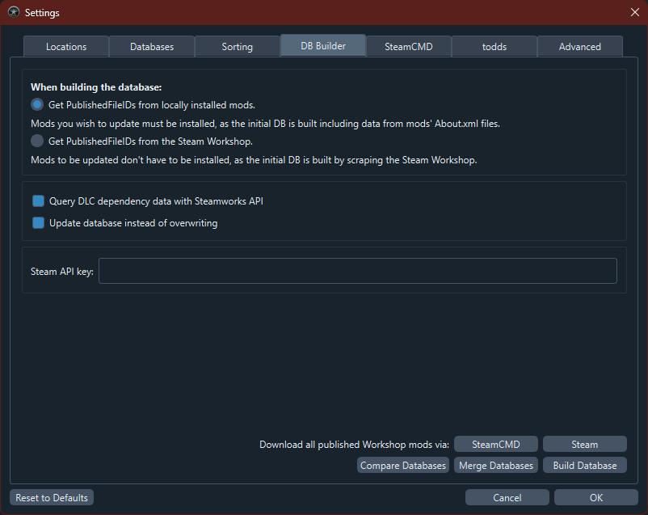

# Steam 数据库构建器
{: .no_toc}

Steam 数据库构建器是一个用于创建和更新 Steam 创意工坊元数据库本地副本的专用工具。

## 目录
{: .no_toc .text-delta }

1. TOC
{:toc}

## 开始使用

_**NOTE:**_ 数据库构建器有一些「隐性要求」。如果你不是 Steam RimWorld 用户，很遗憾，你在构建数据库时可能会受限。

- 你的 Steam 账户需要至少消费 5 美元才能获得 Steam WebAPI 的常规访问权限。这是 RimSort 构建完整 Mod 依赖元数据的重要途径。
- 要使用 SteamWorks 功能，你需要在 Steam 平台拥有 RimWorld。这是 Steam 允许通过 SteamWorks API 访问某些功能的必要条件。

### 如何获取 Steam WebAPI 密钥用于数据库构建器动态查询

1. 打开 Steam [API 密钥注册页](https://steamcommunity.com/login/home/?goto=%2Fdev%2Fapikey)。注册需要 Steam 账户和域名，但实际使用的域名似乎无关紧要：

2. 注册 Steam 账户并申请新 API 密钥后，你应该会看到以下界面：

3. _**请妥善保管你的 Steam 密钥，不要与他人分享。**_ 点击注册按钮后，你将看到新生成的 Steam API 密钥。如需更换密钥，只需点击撤销按钮然后重新注册即可。

4. 在 RimSort 设置面板的 `数据库构建器（DS Builder）` 页，将密钥填入 `Steam API Key`。

数据库构建器有两种「包含」模式，可用于 RimSort 创建、管理、维护和更新 Steam 数据库（与 RimPy 的 db.json 格式兼容）。

以下章节将详细说明每种模式的特点：

## 选项

### 数据库构建模式 (`在构建数据库时：`)

#### 「包含所有 Mod」模式

- 在数据库创建和 WebAPI 配置完成后，可通过 SteamWorks API 查询并添加 DLC 依赖数据。
- 生成的数据库可能不够完整但准确性有保障（无需通过 WebAPI 查询所有 PublishedFileIds），但需要手动提供 PublishedFileIds。系统会针对提供的 PublishedFileIds 进行额外查询以获取 WebAPI 元数据。
- 此模式下，数据库构建器只包含从已下载 Mod 解析的元数据。生成的数据库包含本地可用 Mod 的元数据（包含 packageIds）。
  - 该模式可从头构建完整数据库，但需要下载整个创意工坊内容！
  - 该模式也可对数据库进行部分更新（_无需_ 下载整个创意工坊），但更新后的 Steam 数据库将仅包含 _部分_ 内容。

#### 「不含本地数据」模式

- 在数据库创建和 WebAPI 配置完成后，可通过 SteamWorks API 查询并添加 DLC 依赖数据。
- 通过 WebAPI 查询所有可用 PublishedFileIds（而非手动提供），生成「半完整」的准确数据库。系统会对 Steam WebAPI 提供的全部 PublishedFileIds 进行额外元数据查询。
- 此模式下，数据库构建器 _不_ 包含本地 Mod 元数据。生成的数据库 _不含_ 本地可用 Mod 的元数据（即无 packageIds）。
  - 不使用本地 Mod 元数据，通过调用 Steam WebAPI 获取 PublishedFileIds。
  - 可在未下载任何 Mod 的情况下创建数据库，后续通过「所有 Mod」查询更新本地元数据到列表中。

### 通过 Steamworks API 查询 DLC 依赖数据
{: .d-inline-block}
推荐选项
{: .label .label-green }

若要在数据库中包含 DLC 依赖数据，请确保 Steam 客户端正在运行且已登录，并在 `数据库构建器（DB Builder）` 页启用 `通过 Steamworks API 查询 DLC 依赖数据（Query DLC dependency data with Steamworks API）` 设置项。

### 更新现有数据库而非覆盖
{: .d-inline-block}
推荐选项
{: .label .label-green }

在设置 `数据库构建器（DB Builder）` 中设置 `更新而非覆盖现有数据库（Update database instead of overwriting）` 选项，可选择在运行数据库构建器时，是否更新现有数据库而非覆盖。

启用此选项后，现有数据库将被加载到内存中，更新后写回硬盘。

## 创建自定义 Steam 数据库的流程

1. 打开 RimSort 设置面板中的数据库构建器页，位于菜单 `文件 > 设置 > 数据库构建器（File > Settings > DB Builder）`。

2. 确保已完成上述 Steam WebAPI 密钥配置步骤。

3. （可选）配置数据库过期时间（单位：秒）。 该过期时间将用于生成你数据库的 version 字段，计算方式为数据库创建时的时间戳 + 设定时长。这会影响 RimSort 提示数据库过期的时机，默认值为 1 周。注意：此设置位于 `数据库（Databases）` 页。

4. 根据需求进行配置。（请参考前面的 [选项](#选项) 一节）

5. 点击「构建数据库（Build Database）」进行构建流程。数据库构建器将提示你选择/输入 JSON 文件路径，作为数据库输出位置。

{: .warning}
> 该视频教程已过时，可能不适用于 RimSort 最新版本。

<iframe width="420" height="300" src="https://github.com/RimSort/RimSort/assets/2766946/bfdc5115-e349-4c92-86bc-96a6fcd1e9c6"  allowfullscreen="true" alt="Build Database Demo Video"></iframe>
