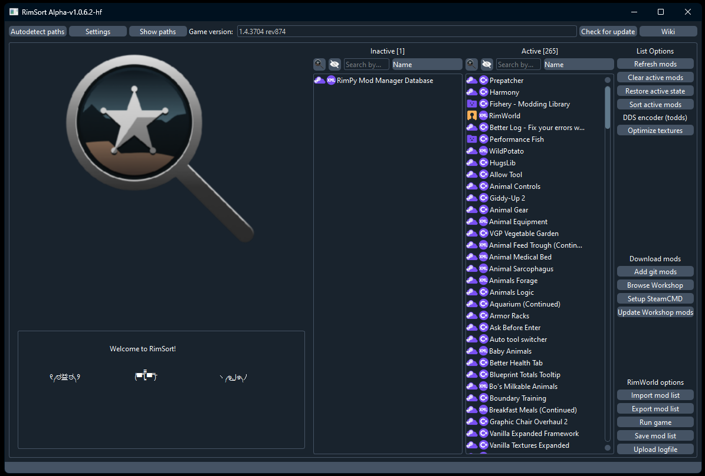

# Downloading and Installing

{: .no_toc}

{: .warning }

> Most users should be utilizing [pre-built releases](https://github.com/RimSort/RimSort/releases) and **_not_** downloading the repository code from `Code > Download ZIP`. This option downloads the source code which is not compiled. You only need the source code if you plan on contributing, building RimSort yourself, or running RimSort via a Python interpreter.

There are two types of RimSort releases. Stable releases, and edge releases. Edge releases come out much more often then stable releases, but are more likely to have bugs.

When downloading a release, make sure to select the file more appropriate for your operating system, CPU architecture, and needs. Launch instructions may be platform specific.

[Stable Release][Stable Release]{: .btn .btn-primary .fs-5 .mb-4 .mb-md-0 .mr-2 }
[Edge Release][Edge Release]{: .btn .fs-5 .mb-4 .mb-md-0 }

## Table of Contents

{: .no_toc .text-delta }

1. TOC
{:toc}

## Windows

{: .d-inline-block}

Windows
{: .label .label-blue }

{: .important }
> On Windows, the executable RimSort.exe may sometimes be incorrectly flagged by your anti-virus solution such as Windows Defender and deleted.
>
> Unfortunately this is a side effect of using [Nuikta](https://nuitka.net/) to compile a Python program into an easy to distribute executable, and not signing it. Signing the release costs a significant amount of money and is a re-occuring cost which is infeasible for us. It is safe to override your anti-virus to allow RimSort. If you are unsure about this, feel free to scan the executable using [Virus Total](https://www.virustotal.com/gui/) which will give you the opinion of multiple anti-virus solutions and then form your own opinion.

- Download and extract the `Windows x86-64` release
- Run the executable: `RimSort.exe`



## macOS

{: .d-inline-block}

macOS
{: .label .label-red }

{: .important }
> You may get an error saying that RimSort is "damaged" from Gatekeeper.
> Apple has it's own Runtime Protection called [Gatekeeper](https://support.apple.com/guide/security/gatekeeper-and-runtime-protection-sec5599b66df/web) that can cause issues when trying to run RimSort (or execute dependent libs)!
> You can circumvent this issue by using `xattr` command to manually whitelist:
>
>     xattr -d com.apple.quarantine /path/to/RimSort.app
>     xattr -d com.apple.quarantine /path/to/libsteam_api.dylib
>
> Replace `/path/to/` with the actual path where the file/folder is, example:
>
>     xattr -d com.apple.quarantine /Users/John/Downloads/RimSort.app
>
> If you are for some reason trying to run the `i386` build on Apple silicon, don't enable watchdog when running the build through Rosetta

{: .note }

> todds texture tool does not currently (as of May 2023) support Apple silicon (Mac M1/M2 ARM64 CPU).

- Download the and extract the Darwin/macOS release that matches your CPU architecture (ARM64 for Apple Silicon, i386 for Intel)
- Use the `xattr` command to circumvent [Gatekeeper](https://support.apple.com/guide/security/gatekeeper-and-runtime-protection-sec5599b66df/web) and whitelist `RimSort.app` and `libsteam_api.dylib`
- Open the app bundle: `RimSort.app`


## Linux

{: .d-inline-block}

Linux
{: .label .label-yellow}

### AppImage (Recommended)

The easiest way to run RimSort on Linux is the AppImage. It bundles all dependencies and works across most distributions without installing anything.

1. Download the `.AppImage` file from the [release page][Releases]
2. Make it executable and run it:

```shell
chmod +x RimSort-*.AppImage
./RimSort-*.AppImage
```

{: .note }
> AppImages require FUSE2 to run. Most distributions include it, but if you get a FUSE-related error, either install `fuse2` / `libfuse2` from your package manager or run with the `--appimage-extract-and-run` flag as a workaround.

**Desktop integration:** For automatic desktop menu integration and easy updates, consider [AppImageLauncher](https://github.com/TheAssassin/AppImageLauncher). It registers AppImages with your desktop environment so they appear in your application menu and can be launched like any other installed app.

**Self-updates:** When running as an AppImage, RimSort's built-in updater replaces the AppImage file in place (the old version is backed up to `.bak` and cleaned up on the next launch).

### Ubuntu Tarball

Pre-built tarball releases are compiled on Ubuntu 22.04 and 24.04. These may also work on other Debian-based distributions or distributions with compatible glibc and library versions, but this is not guaranteed.

1. Download and extract the Ubuntu `.tar.gz` (or `.zip`) release matching your Ubuntu version
2. Run the executable:

```shell
./RimSort
```

{: .important }
> If none of the pre-built releases work for your distribution, you can [build RimSort from source or run it from the Python interpreter](../development-guide/development-setup).


### Qt Dependencies

RimSort uses Qt (PySide6) for its GUI. If you are using the tarball release (not the AppImage), your system may be missing required Qt shared libraries. The most common missing library is `libxcb-cursor`.

**Debian / Ubuntu:**

```shell
sudo apt install libxcb-cursor0
```

If you encounter other missing library errors, use `apt-file` to find the package:

```shell
sudo apt install apt-file
apt-file update
apt-file search libxcb-whatever.so
```

**Fedora / RHEL:**

```shell
sudo dnf install xcb-util-cursor
```

Use `dnf provides` to find packages for other missing libraries:

```shell
dnf provides '*/libxcb-whatever.so*'
```

**Arch / Manjaro:**

```shell
sudo pacman -S xcb-util-cursor
```

Use `pkgfile` to search for missing libraries:

```shell
pkgfile libxcb-whatever.so
```

### RimWorld Paths on Linux

RimSort needs to know where RimWorld is installed and where its configuration lives. The paths differ depending on how Steam and RimWorld are installed.

{: .important }
> **Native Steam (from your distro's package manager) and the native linux version of RimWorld are the preferred and recommended installation method.** Running RimWorld through its native Linux build provides the best compatibility with RimSort.

#### Native Steam (Recommended)

| Path | Location |
|------|----------|
| Game install | `~/.local/share/Steam/steamapps/common/RimWorld/` |
| Config folder | `~/.config/unity3d/Ludeon Studios/RimWorld by Ludeon Studios/Config/` |
| Workshop mods | `~/.local/share/Steam/steamapps/workshop/content/294100/` |
| Saves | `~/.config/unity3d/Ludeon Studios/RimWorld by Ludeon Studios/Saves/` |

If you have Steam libraries on other drives, the game install and workshop paths will be under that library's `steamapps/` directory instead.

#### Flatpak Steam

If you installed Steam via Flatpak, all paths are sandboxed under `~/.var/app/com.valvesoftware.Steam/`:

| Path | Location |
|------|----------|
| Game install | `~/.var/app/com.valvesoftware.Steam/.local/share/Steam/steamapps/common/RimWorld/` |
| Config folder | `~/.config/unity3d/Ludeon Studios/RimWorld by Ludeon Studios/Config/` |
| Workshop mods | `~/.var/app/com.valvesoftware.Steam/.local/share/Steam/steamapps/workshop/content/294100/` |

{: .warning }
> **Snap Steam is not recommended and not supported.** The Steam Snap package has known issues with game compatibility and is not officially supported by Valve. Use the native `.deb` package or the Flatpak version instead.

#### Proton (Windows version of RimWorld via Steam Play)

If you are running the Windows version of RimWorld through Proton instead of the native Linux build, the config folder is inside Proton's virtual Windows filesystem:

| Path | Location |
|------|----------|
| Config folder | `~/.local/share/Steam/steamapps/compatdata/294100/pfx/drive_c/users/steamuser/AppData/LocalLow/Ludeon Studios/RimWorld by Ludeon Studios/Config/` |
| Saves | `~/.local/share/Steam/steamapps/compatdata/294100/pfx/drive_c/users/steamuser/AppData/LocalLow/Ludeon Studios/RimWorld by Ludeon Studios/Saves/` |

The game install and workshop mod paths remain the same as native Steam. If using Flatpak Steam with Proton, prefix the compatdata path with `~/.var/app/com.valvesoftware.Steam/` as above.

{: .note }
> When running via Proton, the RimWorld executable is `RimWorldWin64.exe` (or `RimWorldWin.exe`) rather than `RimWorldLinux`. RimSort detects both automatically, but keep this in mind if you are setting paths manually.

{: .note }
> The native Linux build of RimWorld is recommended over Proton. It provides simpler paths and better compatibility with RimSort's features.

### RimSort Data Locations

RimSort stores its own data using platform-appropriate directories (via `platformdirs`):

| Data | Location |
|------|----------|
| App data / settings | `~/.local/share/RimSort/` |
| Logs | `~/.local/state/RimSort/log/RimSort.log` |

To enable debug logging, create an empty file named `DEBUG` in the app data folder:

```shell
touch ~/.local/share/RimSort/DEBUG
```

### Wayland vs X11

RimSort uses PySide6 (Qt6), which supports Wayland natively. In most cases it will work without any extra configuration.

If you experience rendering issues or crashes on Wayland, you can force X11 mode via XWayland:

```shell
QT_QPA_PLATFORM=xcb ./RimSort
```

Or for the AppImage:

```shell
QT_QPA_PLATFORM=xcb ./RimSort-*.AppImage
```

### Troubleshooting

**glibc version mismatch:**
The pre-built tarball releases are linked against Ubuntu's glibc. If your distribution ships an older glibc, you may see errors like `GLIBC_2.xx not found`. Use the AppImage instead, or [build from source](../development-guide/development-setup).

**AppImage won't start (FUSE error):**
Install `fuse2` or `libfuse2` from your package manager. Alternatively, run with `--appimage-extract-and-run` to bypass the FUSE requirement.

**AppImage self-update fails:**
The AppImage must be in a user-writable location. If you placed it somewhere that requires root access (e.g., `/opt/`), either move it to your home directory or update manually.

**Steam integration not working:**
Ensure Steam is running before launching RimSort. The Steamworks API requires an active Steam client connection. If using Flatpak Steam, RimSort (running outside the sandbox) may not be able to communicate with it — native Steam is recommended.

**Mod paths not detected:**
If RimSort can't find your mods or config, double-check which Steam installation method you're using (native, Flatpak, or Snap) and set the paths manually in RimSort's settings. See the [path tables above](#rimworld-paths-on-linux).

**Last resort — run from source:**
If no pre-built release works for your setup, you can always run RimSort directly from the Python source. See the [Development Setup guide](../development-guide/development-setup) for instructions.

[Releases]: https://github.com/RimSort/RimSort/releases
[Stable Release]: https://github.com/RimSort/RimSort/releases/latest
[Edge Release]: https://github.com/RimSort/RimSort/releases/tag/Edge
