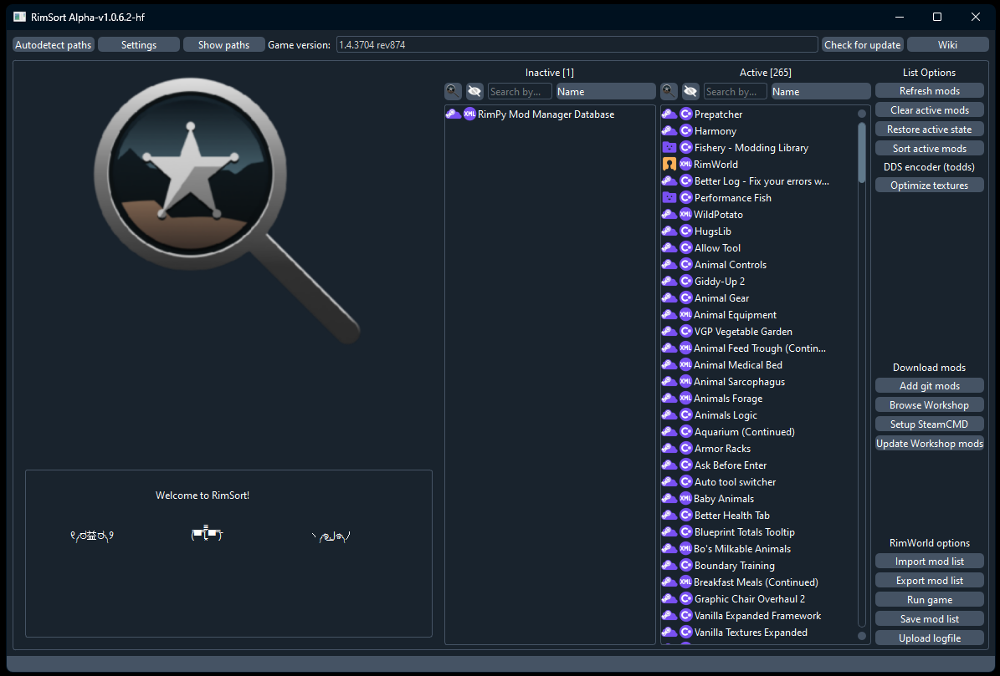

# 下载和安装

{: .no_toc}

{: .warning }

> 大多数用户应当使用 [预构建版本](https://github.com/RimSort/RimSort/releases)，而**_不要_**通过 `Code > Download ZIP` 下载仓库代码。该选项下载的是未经编译的源代码，仅当您计划参与贡献，自行构建 RimSort，或使用 Python 解释器运行 RimSort 时才需要获取源代码。

RimSort 提供两种发行版本：稳定版（stable releases）和前瞻版（edge releases）。前瞻版的更新频率高于稳定版，但更可能存在 Bug。

下载时请根据操作系统、CPU 架构及实际需求选择对应文件。启动说明可能因平台而异。

[稳定版][稳定版]{: .btn .btn-primary .fs-5 .mb-4 .mb-md-0 .mr-2 }
[前瞻版][前瞻版]{: .btn .fs-5 .mb-4 .mb-md-0 }

## 目录

{: .no_toc .text-delta }

1. TOC
{:toc}

## Windows

{: .d-inline-block}

Windows
{: .label .label-blue }

{: .important }
> 在 Windows 上，RimSort.exe 有时可能会被您的反病毒软件（例如 Windows Defender）误判为威胁并删除。
>
> 这是使用 [Nuikta](https://nuitka.net/) 将 Python 程序编译为易于分发的可执行文件，且未进行数字签名所产生的副作用。为发布程序进行数字签名需要高昂且持续的费用，这对我们而言并不现实。您可以安全地配置反病毒软件，以允许 RimSort 运行。若对此存疑，建议使用 Virus Total 扫描该可执行文件，该平台会综合多家反病毒软件的检测结果供您参考判断。

- 下载并解压 `Windows x86-64` 版本
- 运行程序：`RimSort.exe`



## macOS

{: .d-inline-block}

macOS
{: .label .label-red }

{: .important }
> 您可能会遇到 Gatekeeper 提示 RimSort 已「损坏」的错误。
> 苹果自有的运行时保护机制 [Gatekeeper](https://support.apple.com/guide/security/gatekeeper-and-runtime-protection-sec5599b66df/web) 可能导致运行 RimSort（或执行相关依赖库）时出现问题！
> 可通过以下 `xattr` 命令手动添加白名单规避此问题：
>
>     xattr -d com.apple.quarantine /path/to/RimSort.app
>     xattr -d com.apple.quarantine /path/to/libsteam_api.dylib
>
> 将 `/path/to/` 替换为文件/文件夹的实际路径，例如：
>
>     xattr -d com.apple.quarantine /Users/John/Downloads/RimSort.app
>
> 如果因某些原因尝试在 Apple Silicon 芯片上运行 `x86_64` 架构版本，使用 Rosetta 运行时应禁用看门狗功能。

{: .note }

> 截至 2023 年 5 月，todds 纹理工具目前不支持 Apple Silicon 芯片（Mac M1/M2 ARM64 CPU）。

- 下载并解压与你的 CPU 架构匹配的 Darwin/macOS 版本（Apple Silicon 选择 ARM64，Intel 选择 x86_64）
- 使用 `xattr` 命令绕过 [Gatekeeper](https://support.apple.com/guide/security/gatekeeper-and-runtime-protection-sec5599b66df/web)，将 `RimSort.app` 和 `libsteam_api.dylib` 加入白名单
- 打开应用：`RimSort.app`


## Linux

{: .d-inline-block}

Linux
{: .label .label-yellow}

### AppImage（推荐）

在 Linux 上运行 RimSort 最简单的方式是 AppImage。它捆绑了所有依赖，无需安装任何内容即可在大多数发行版上运行。

1. 从[发布页面][Releases]下载 `.AppImage` 文件
2. 使其可执行并运行：

```shell
chmod +x RimSort-*.AppImage
./RimSort-*.AppImage
```

{: .note }
> AppImage 需要 FUSE2 才能运行。大多数发行版都已内置，但如果您遇到 FUSE 相关错误，请从软件包管理器安装 `fuse2` / `libfuse2`，或使用 `--appimage-extract-and-run` 标志作为临时解决方案。

**桌面环境集成：** 如需自动集成到桌面菜单并方便更新，可以考虑 [AppImageLauncher](https://github.com/TheAssassin/AppImageLauncher)。它会将 AppImage 注册到您的桌面环境中，使其出现在应用程序菜单中，并像其他已安装的应用一样启动。

**自动更新：** 以 AppImage 形式运行时，RimSort 的内置更新器会就地替换 AppImage 文件（旧版本备份为 `.bak`，并在下次启动时清理）。

### Ubuntu Tarball

预构建的 tarball 发行版在 Ubuntu 22.04 和 24.04 上编译。它们也可能适用于其他基于 Debian 的发行版或 glibc 和库版本兼容的发行版，但这不保证。

1. 下载并解压与您的 Ubuntu 版本匹配的 Ubuntu `.tar.gz`（或 `.zip`）发行版
2. 运行可执行文件：

```shell
./RimSort
```

{: .important }
> 如果没有适用于您的发行版的预构建版本，您可以[从源代码构建 RimSort 或通过 Python 解释器运行](../development-guide/development-setup)。


### Qt 依赖

RimSort 使用 Qt（PySide6）作为其 GUI。如果您使用的是 tarball 发行版（而非 AppImage），系统可能缺少所需的 Qt 共享库。最常见的缺失库是 `libxcb-cursor`。

**Debian / Ubuntu：**

```shell
sudo apt install libxcb-cursor0
```

如果遇到其他缺失库错误，请使用 `apt-file` 查找对应软件包：

```shell
sudo apt install apt-file
apt-file update
apt-file search libxcb-whatever.so
```

**Fedora / RHEL：**

```shell
sudo dnf install xcb-util-cursor
```

使用 `dnf provides` 查找其他缺失库的软件包：

```shell
dnf provides '*/libxcb-whatever.so*'
```

**Arch / Manjaro：**

```shell
sudo pacman -S xcb-util-cursor
```

使用 `pkgfile` 搜索缺失库：

```shell
pkgfile libxcb-whatever.so
```

### Linux 下 RimWorld 路径

RimSort 需要知道 RimWorld 的安装位置及其配置的存放位置。路径因 Steam 和 RimWorld 的安装方式而异。

{: .important }
> **原生 Steam（来自发行版软件包管理器）和 RimWorld 原生的 linux 版本是优先且推荐的安装方式。** 通过其原生 Linux 构建运行 RimWorld 可与 RimSort 实现最佳兼容。

#### 原生 Steam（推荐）

| 路径 | 位置 |
|------|----------|
| 游戏安装 | `~/.local/share/Steam/steamapps/common/RimWorld/` |
| 配置文件夹 | `~/.config/unity3d/Ludeon Studios/RimWorld by Ludeon Studios/Config/` |
| 创意工坊 Mod | `~/.local/share/Steam/steamapps/workshop/content/294100/` |
| 存档 | `~/.config/unity3d/Ludeon Studios/RimWorld by Ludeon Studios/Saves/` |

如果您的 Steam 库位于其他驱动器，游戏安装和创意工坊路径将位于该库的 `steamapps/` 目录下。

#### Flatpak Steam

如果您通过 Flatpak 安装 Steam，所有路径都被沙箱隔离到 `~/.var/app/com.valvesoftware.Steam/` 下：

| 路径 | 位置 |
|------|----------|
| 游戏安装 | `~/.var/app/com.valvesoftware.Steam/.local/share/Steam/steamapps/common/RimWorld/` |
| 配置文件夹 | `~/.config/unity3d/Ludeon Studios/RimWorld by Ludeon Studios/Config/` |
| 创意工坊 Mod | `~/.var/app/com.valvesoftware.Steam/.local/share/Steam/steamapps/workshop/content/294100/` |

{: .warning }
> **不推荐也不支持 Snap Steam。** Steam 的 Snap 软件包存在已知的游戏兼容性问题，且 Valve 官方不支持。请改用原生 `.deb` 软件包或 Flatpak 版本。

#### Proton（通过 Steam Play 运行 Windows 版 RimWorld）

如果您通过 Proton 运行 Windows 版 RimWorld 而非原生 Linux 构建，配置文件夹位于 Proton 的虚拟 Windows 文件系统中：

| 路径 | 位置 |
|------|----------|
| 配置文件夹 | `~/.local/share/Steam/steamapps/compatdata/294100/pfx/drive_c/users/steamuser/AppData/LocalLow/Ludeon Studios/RimWorld by Ludeon Studios/Config/` |
| 存档 | `~/.local/share/Steam/steamapps/compatdata/294100/pfx/drive_c/users/steamuser/AppData/LocalLow/Ludeon Studios/RimWorld by Ludeon Studios/Saves/` |

游戏安装和创意工坊 Mod 的路径与原生 Steam 相同。如果您在使用 Proton 时使用 Flatpak Steam，请按上述方法在 compatdata 路径前添加 `~/.var/app/com.valvesoftware.Steam/`。

{: .note }
> 通过 Proton 运行时，RimWorld 的可执行文件是 `RimWorldWin64.exe`（或 `RimWorldWin.exe`），而非 `RimWorldLinux`。RimSort 会自动识别两者，但如果您手动设置路径，请牢记这一点。

{: .note }
> 原生 Linux 构建的 RimWorld 优于 Proton。它的路径更简单，与 RimSort 功能的兼容性更好。

### RimSort 数据位置

RimSort 使用适合平台的目录存储自己的数据（通过 `platformdirs`）：

| 数据 | 位置 |
|------|----------|
| 应用数据 / 设置 | `~/.local/share/RimSort/` |
| 日志 | `~/.local/state/RimSort/log/RimSort.log` |

要启用调试日志，请在应用数据文件夹中创建一个名为 `DEBUG` 的空文件：

```shell
touch ~/.local/share/RimSort/DEBUG
```

### Wayland 与 X11

RimSort 使用 PySide6（Qt6），它原生支持 Wayland。在大多数情况下无需额外配置即可正常工作。

如果您在 Wayland 上遇到渲染问题或崩溃，可以通过 XWayland 强制使用 X11 模式：

```shell
QT_QPA_PLATFORM=xcb ./RimSort
```

或对于 AppImage：

```shell
QT_QPA_PLATFORM=xcb ./RimSort-*.AppImage
```

### 故障排除

**glibc 版本不匹配：**
预构建的 tarball 发行版与 Ubuntu 的 glibc 链接。如果您的发行版提供较旧的 glibc，您可能会看到类似 `GLIBC_2.xx not found` 的错误。请改用 AppImage，或[从源代码构建](../development-guide/development-setup)。

**AppImage 无法启动（FUSE 错误）：**
请从软件包管理器安装 `fuse2` 或 `libfuse2`。或者使用 `--appimage-extract-and-run` 运行以绕过 FUSE 要求。

**AppImage 自动更新失败：**
AppImage 必须位于用户可写的位置。如果您将其放在需要 root 权限的地方（例如 `/opt/`），请将其移动到主目录或手动更新。

**Steam 集成无法使用：**
启动 RimSort 前请确保 Steam 正在运行。Steamworks API 需要活跃的 Steam 客户端连接。如果使用 Flatpak Steam，RimSort（在沙箱外运行）可能无法与之通信——推荐使用原生 Steam。

**未检测到 Mod 路径：**
如果 RimSort 找不到您的 Mod 或配置，请仔细检查您使用的 Steam 安装方式（原生、Flatpak 或 Snap），并在 RimSort 设置中手动设置路径。请参阅[上方的路径表](#linux-下-rimworld-路径)。

**最后手段——从源代码运行：**
如果没有预构建的发行版适用于您的设置，您始终可以直接从 Python 源代码运行 RimSort。操作说明请参阅[开发配置指南](../development-guide/development-setup)。

[所有发布]: https://github.com/RimSort/RimSort/releases
[稳定版]: https://github.com/RimSort/RimSort/releases/latest
[前瞻版]: https://github.com/RimSort/RimSort/releases/tag/Edge
