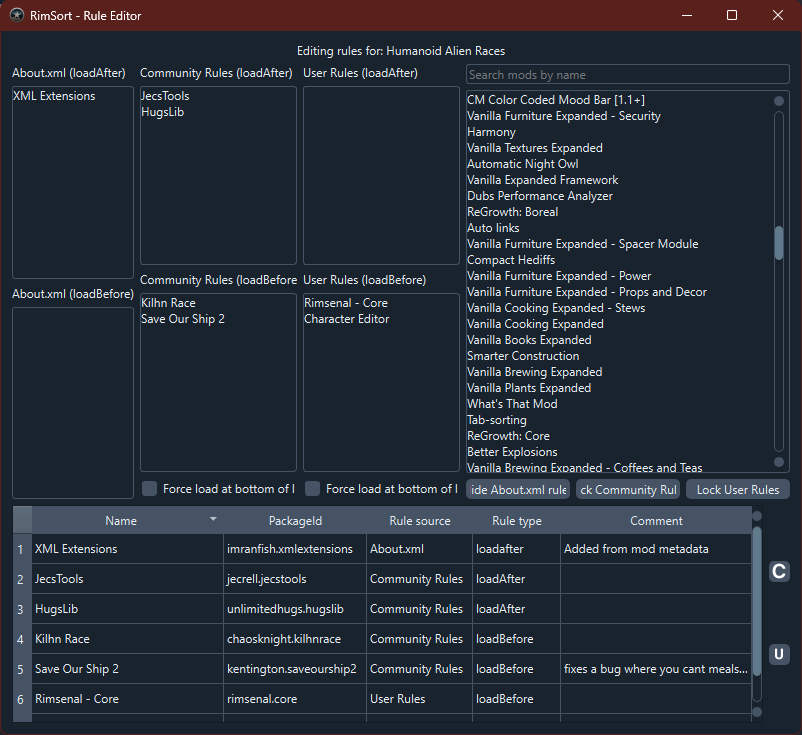

# Rule Editor

To access the rule editor either navigate to `Edit > Rule Editor...` in the main menu bar, or open the context menu for the mod you wish to edit and navigate to `Miscellaneous Options > Edit mod with Rule Editor`.

## Overview

The Rule Editor is a powerful tool in RimSort that allows you to view, create, and modify load order rules for mods. These rules determine how mods are sorted and loaded in RimWorld, ensuring compatibility and proper functionality. The editor supports three types of rules:

- **About.xml Rules**: Rules defined directly in a mod's `About.xml` file (read-only)
- **Community Rules**: Shared rules contributed by the community
- **User Rules**: Personal rules you create for your own use

## Accessing the Rule Editor

### From the Main Menu
1. Click on `Edit` in the main menu bar
2. Select `Rule Editor...`

### From a Mod's Context Menu
1. Right-click on a mod in the active or inactive mods list
2. Navigate to `Miscellaneous Options > Edit mod with Rule Editor`

## Interface Layout

The Rule Editor window is divided into several sections:

### Mod Details Panel (Left Side)
This panel shows the rules for the currently selected mod, organized by rule type:

- **About.xml (loadAfter)**: Mods that must load after this mod
- **About.xml (loadBefore)**: Mods that must load before this mod
- **About.xml (incompatibilitiesWith)**: Mods that are incompatible with this mod

- **Community Rules (loadAfter/loadBefore/incompatibilitiesWith)**: Community-defined rules
- **Force load at top/bottom**: Checkboxes to force the mod to load at the top or bottom of the list

### Mods List (Top Right)
- A searchable list of all available mods
- Use the search bar to filter mods by name
- Drag mods from this list to the rule panels to create new rules

### Rules Editor Table (Bottom)
A table displaying all rules for the current mod with the following columns:
- **Name**: The display name of the related mod
- **PackageId**: The unique identifier of the related mod
- **Rule source**: About.xml, Community Rules, or User Rules
- **Rule type**: loadAfter, loadBefore, incompatibleWith, loadTop, or loadBottom
- **Comment**: Optional annotation explaining the rule

## Using the Rule Editor

### Viewing Rules for a Mod
1. Open the Rule Editor for a specific mod (via context menu) or start with an empty editor
2. If starting empty, right-click a mod in the mods list and select "Open this mod in the editor"
3. The mod's name will appear at the top, and all its rules will be populated in the panels and table

### Creating New Rules
1. Find the target mod in the mods list (use search if needed)
2. Drag the mod from the list to one of the rule panels:
   - Drop on "loadAfter" to make the dragged mod load after the current mod
   - Drop on "loadBefore" to make the dragged mod load before the current mod
   - Drop on "incompatibilitiesWith" to mark the mods as incompatible
3. When prompted, enter a comment explaining why this rule exists
4. The new rule will appear in the rules table

### Editing Rules
- **About.xml rules** are read-only and cannot be modified
- For **Community Rules** and **User Rules**, you can edit the comment by double-clicking the comment cell in the rules table
- Use the checkboxes to enable/disable "Force load at top/bottom" rules

### Removing Rules
1. Right-click on a rule in any of the rule panels
2. Select "Remove this rule"
3. The rule will be removed from both the panel and the table

### Saving Changes
- Click the save button for the rule type you modified:
  - **Save Community Rules** button (disk icon with community rules tooltip)
  - **Save User Rules** button (disk icon with user rules tooltip)
- Changes are saved to the respective JSON files and the metadata cache is refreshed

## Rule Types Explained

### loadAfter
This mod must load after the specified mod(s). Useful when your mod depends on another mod's functionality.

### loadBefore
This mod must load before the specified mod(s). Useful when other mods depend on your mod.

### incompatibleWith
This mod cannot be loaded alongside the specified mod(s). RimSort will show warnings when incompatible mods are both active.

### loadTop
Forces this mod to load at the very top of the mod list, regardless of other rules.

### loadBottom
Forces this mod to load at the very bottom of the mod list, regardless of other rules.

## Advanced Features

### Toggling Rule Visibility
Use the buttons at the bottom of the mods list to show/hide different rule types:
- **Show/Hide About.xml rules**: Toggle visibility of rules from mod metadata
- **Edit/Lock Community Rules**: Toggle editing mode for community rules
- **Edit/Lock User Rules**: Toggle editing mode for user rules

Hidden rules are also hidden in the rules table for a cleaner view.

### Searching Mods
Use the search bar above the mods list to quickly find specific mods by name. The list will filter in real-time as you type.

### Context Menus
- **Mods List**: Right-click any mod to open it in the editor
- **Rule Panels**: Right-click any rule to remove it

## Best Practices

1. **Always add comments**: Explain why a rule exists for future reference and to help other users
2. **Test after changes**: After saving rules, sort your mods and check for any new warnings or errors
3. **Use Community Rules when possible**: Prefer community-contributed rules over personal ones for better compatibility
4. **Backup before major changes**: Consider backing up your user rules file before making extensive modifications
5. **Check for conflicts**: Review the rules table to ensure no contradictory rules exist

## Troubleshooting

### Rules Not Applying
- Ensure you've saved the changes using the appropriate save button
- Restart RimSort or refresh the metadata cache
- Check that the mod's PackageId matches exactly

### Cannot Edit Certain Rules
- About.xml rules are read-only as they come from the mod's metadata
- Make sure you're in "Edit" mode for Community/User rules (buttons should say "Lock" when editing is enabled)

### Performance Issues
- The Rule Editor loads all mod metadata; if you have many mods, it may take a moment to populate
- Use the search and visibility toggles to manage large lists efficiently

## Related Topics

- [Databases](../user-guide/databases): Learn about the Community Rules and User Rules databases
