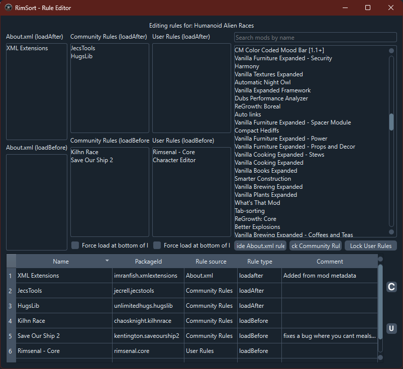

# Редактор правил

Откройте через **Edit → Rule Editor...** или контекстное меню мода: **Miscellaneous Options → Edit mod with Rule Editor**.

## Обзор

Редактор правил порядка загрузки модов. Три типа:

- **About.xml** — в `About.xml` мода (только чтение)
- **Community Rules** — общие правила сообщества
- **User Rules** — ваши правила

## Доступ

### Из меню

1. **Edit**
2. **Rule Editor...**

### Из списка модов

1. ПКМ на мод
2. **Miscellaneous Options → Edit mod with Rule Editor**

## Интерфейс

### Панель правил (слева)

- **About.xml (loadAfter)** — после этого мода
- **About.xml (loadBefore)** — перед этим модом
- **About.xml (incompatibilitiesWith)** — несовместимые
- **Community / User rules** — loadAfter, loadBefore, incompatibleWith
- **Force top/bottom** — принудительно в начало/конец списка

### Список модов (справа сверху)

Поиск и перетаскивание модов в панели правил.

### Таблица правил (снизу)

Колонки: имя, PackageId, источник, тип правила, комментарий.

## Работа с правилами

### Просмотр

Откройте редактор для мода или ПКМ в списке — **Open this mod in this editor**.

### Создание

1. Найдите мод в списке
2. Перетащите в loadAfter / loadBefore / incompatibilitiesWith
3. Добавьте комментарий

### Редактирование

- About.xml — только чтение
- Community/User — двойной клик на комментарий
- Чекбоксы load top/bottom

### Удаление

ПКМ на правило → **Delete this rule**.

### Сохранение

Кнопки **Save community rules** / **Save user rules** — JSON и обновление кэша.

## Типы правил

### loadAfter

Мод загружается после указанных.

### loadBefore

Мод загружается перед указанными.

### incompatibleWith

Нельзя активировать вместе — RimSort покажет предупреждение.

### loadTop / loadBottom

Принудительно в начало или конец списка.

## Дополнительно

- Кнопки показа/скрытия About.xml, community, user rules
- Поиск в списке модов
- ПКМ: открыть мод, удалить правило

## Рекомендации

1. Комментируйте правила
2. После изменений — Sort и проверка предупреждений
3. Предпочитайте community rules
4. Бэкап user rules перед большими правками
5. Проверяйте конфликты в таблице

## Устранение проблем

### Правила не применяются

- Сохраните через кнопки Save
- Перезапуск RimSort или обновление кэша
- Проверьте PackageId

### Не редактируются

- About.xml — только чтение
- Community/User — режим Edit (кнопка «Lock»)

### Медленно

Много модов — используйте поиск и фильтры видимости.

## См. также

- [Базы данных](databases) — community и user rules DB
