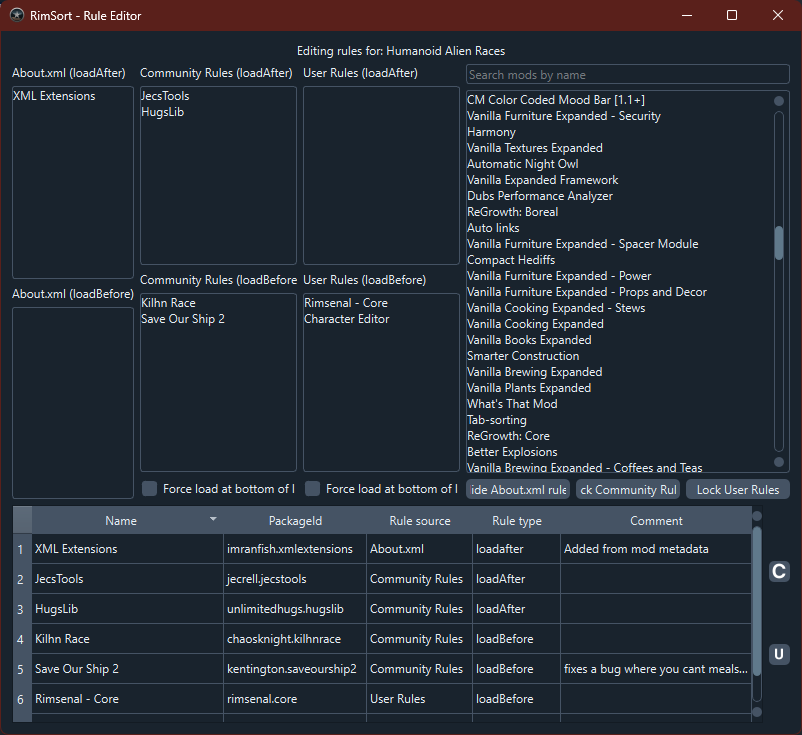

# 规则编辑器

要访问规则编辑器，你可以在主菜单栏中点击 `编辑 > 规则编辑器...（Edit > Rule Editor...）`，或者右击想要编辑的 Mod，在上下文菜单中选择 `其他选项 > 在规则编辑器中编辑（Miscellaneous Options > Edit mod with Rule Editor）`。

## 概述

规则编辑器是 RimSort 中的强大工具，允许你查看、创建和修改 Mod 加载顺序规则。这些规则决定了 Mod 在 RimWorld 中的排序和加载方式，确保兼容性和正常功能。该编辑器支持三种类型的规则：

- **About.xml 规则**：直接在 Mod 的 `About.xml` 文件中定义的规则（只读）
- **社区规则**：社区贡献的共享规则
- **用户规则**：你创建的个人规则

## 访问规则编辑器

### 从主菜单
1. 点击主菜单栏中的 `编辑`
2. 选择 `规则编辑器...`

### 从 Mod 的上下文菜单
1. 右击活动或非活动 Mod 列表中的 Mod
2. 导航到 `其他选项 > 在规则编辑器中编辑`

## 界面布局

规则编辑器窗口分为几个部分：

### Mod 详细信息面板（左侧）
此面板显示当前选中 Mod 的规则，按规则类型组织：

- **About.xml（loadAfter）**：此 Mod 后加载的 Mod
- **About.xml（loadBefore）**：此 Mod 前加载的 Mod
- **About.xml（incompatibilitiesWith）**：与此 Mod 不兼容的 Mod

- **社区规则（loadAfter/loadBefore/incompatibilitiesWith）**：社区定义的规则
- **强制排序至顶部/底部**：复选框，用于强制 Mod 加载到列表顶部或底部

### Mod 列表（右侧顶部）
- 可搜索的所有可用 Mod 列表
- 使用搜索栏按名称过滤 Mod
- 从此列表拖拽 Mod 到规则面板以创建新规则

### 规则编辑器表格（底部）
显示当前 Mod 的所有规则的表格，包含以下列：
- **名称**：相关 Mod 的显示名称
- **PackageId**：相关 Mod 的唯一标识符
- **规则来源**：About.xml、社区规则或用户规则
- **规则类型**：loadAfter、loadBefore、incompatibleWith、loadTop 或 loadBottom
- **注释**：解释规则的可选注释

## 使用规则编辑器

### 查看 Mod 的规则
1. 为特定 Mod 打开规则编辑器（通过上下文菜单）或从空编辑器开始
2. 如果从空编辑器开始，右击 Mod 列表中的 Mod 并选择"在此编辑器中打开此 Mod"
3. Mod 的名称将出现在顶部，其所有规则将在面板和表格中填充

### 创建新规则
1. 在 Mod 列表中找到目标 Mod（使用搜索过滤）
2. 将 Mod 从列表拖拽到其中一个规则面板：
   - 拖拽到 "loadAfter" 以使拖拽的 Mod 在当前 Mod 后加载
   - 拖拽到 "loadBefore" 以使拖拽的 Mod 在当前 Mod 前加载
   - 拖拽到 "incompatibilitiesWith" 以标记 Mod 为不兼容
3. 出现提示时，输入解释此规则原因的注释
4. 新规则将出现在规则表格中

### 编辑规则
- **About.xml 规则** 是只读的，无法修改
- 对于 **社区规则** 和 **用户规则**，你可以通过双击规则表格中的注释单元格来编辑注释
- 使用复选框启用/禁用"强制排序至顶部/底部"规则

### 删除规则
1. 右击任何规则面板中的规则
2. 选择"删除此规则"
3. 该规则将从面板和表格中移除

### 保存更改
- 点击相应规则类型的保存按钮：
  - **保存社区规则** 按钮（带有社区规则工具提示的磁盘图标）
  - **保存用户规则** 按钮（带有用户规则工具提示的磁盘图标）
- 更改将保存到相应的 JSON 文件，并刷新元数据缓存

## 规则类型说明

### loadAfter
此 Mod 必须在指定 Mod 后加载。当你的 Mod 依赖于另一个 Mod 的功能时很有用。

### loadBefore
此 Mod 必须在指定 Mod 前加载。当其他 Mod 依赖于你的 Mod 时很有用。

### incompatibleWith
此 Mod 不能与指定 Mod 同时加载。RimSort 将在不兼容的 Mod 都被激活时显示警告。

### loadTop
强制此 Mod 加载到 Mod 列表的最顶部，无论其他规则如何。

### loadBottom
强制此 Mod 加载到 Mod 列表的最底部，无论其他规则如何。

## 高级功能

### 切换规则可见性
使用 Mod 列表底部的按钮显示/隐藏不同规则类型：
- **显示/隐藏 About.xml 规则**：切换从 Mod 元数据读取的规则可见性
- **编辑/锁定社区规则**：切换社区规则的编辑模式
- **编辑/锁定用户规则**：切换用户规则的编辑模式

隐藏的规则也会在规则表格中隐藏，以获得更清晰的视图。

### 搜索 Mod
使用 Mod 列表上方的搜索栏快速查找特定 Mod。列表将实时过滤输入内容。

### 上下文菜单
- **Mod 列表**：右击任何 Mod 以在编辑器中打开
- **规则面板**：右击任何规则以删除

## 最佳实践

1. **始终添加注释**：解释规则存在的原因，以供将来参考并帮助其他用户
2. **更改后测试**：保存规则后，排序你的 Mod 并检查是否有新的警告或错误
3. **尽可能使用社区规则**：优先使用社区贡献的规则以获得更好的兼容性
4. **重大更改前备份**：考虑在进行大量修改前备份你的用户规则文件
5. **检查冲突**：查看规则表格以确保不存在矛盾的规则

## 故障排除

### 规则未应用
- 确保使用相应的保存按钮保存了更改
- 重新启动 RimSort 或刷新元数据缓存
- 检查 Mod 的 PackageId 是否完全匹配

### 无法编辑某些规则
- About.xml 规则是从 Mod 元数据读取的，只读
- 确保对于社区/用户规则，你处于"编辑"模式（按钮应显示"锁定"当编辑启用时）

### 性能问题
- 规则编辑器加载所有 Mod 元数据；如果你有许多 Mod，可能需要片刻填充
- 使用搜索和可见性切换来高效管理大型列表

## 相关主题

- [数据库](../user-guide/databases.zh-cn)：了解社区规则和用户规则数据库

